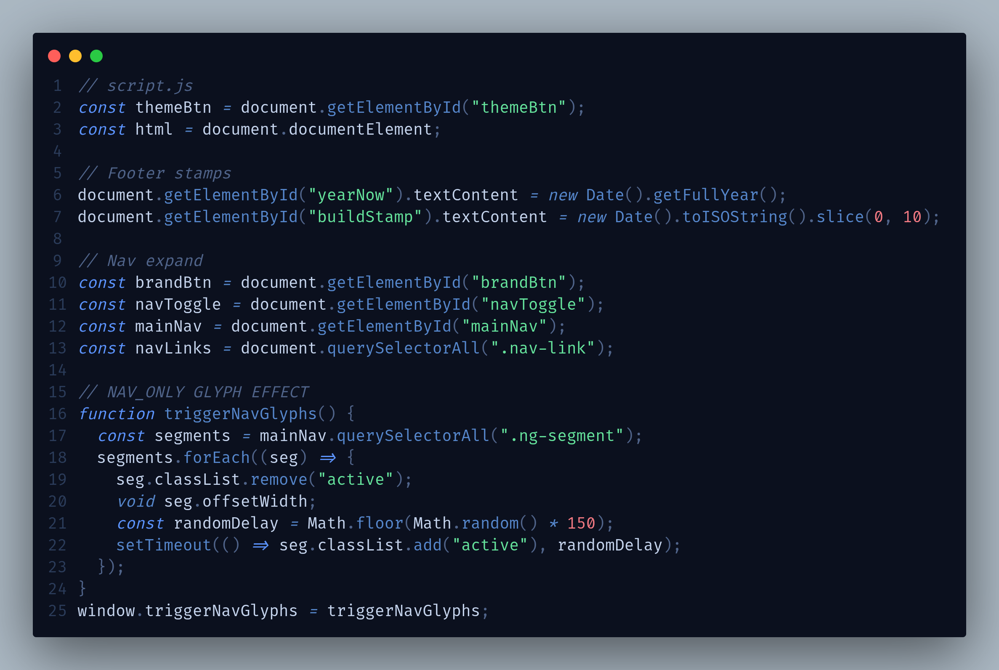
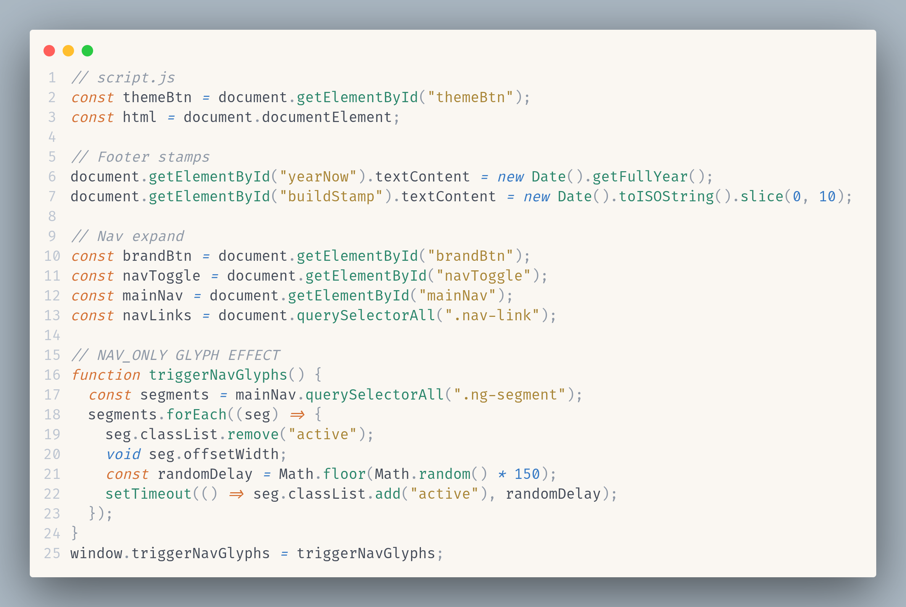
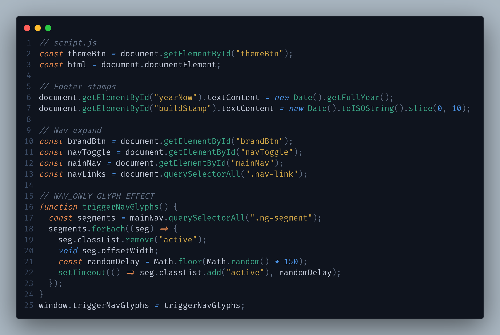
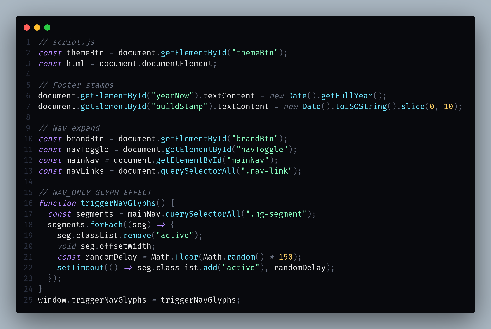
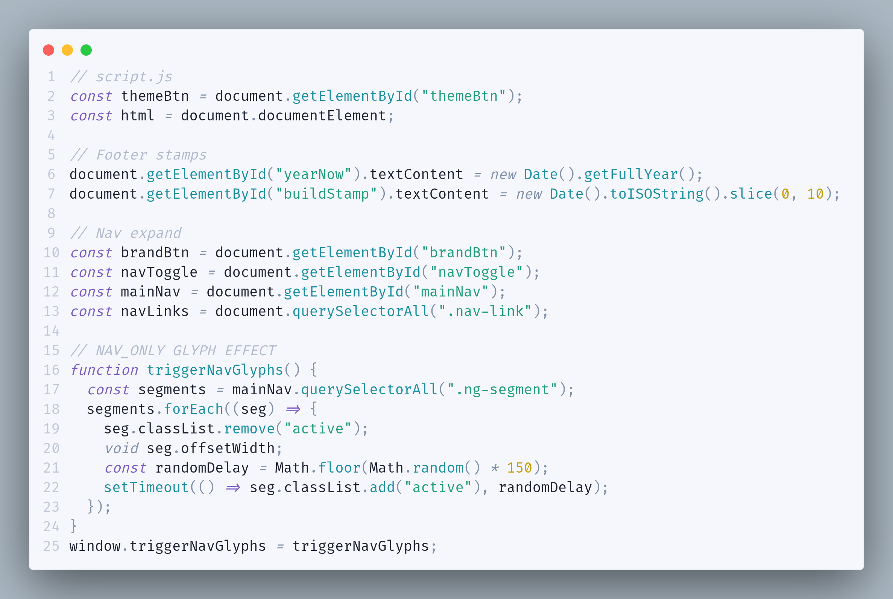

  

<h1 align="center">Nyxora</h1>

  A premium, modern, minimalist theme collection for Visual Studio Code. 
  Highly readable · Low eye strain · Professional &amp; consistent across all languages.

  
  
  

---

## Themes

### 🌑 Nyxora Midnight

---

### 🌸 Nyxora Aurora Light

---

### 🌿 Nyxora Aurora Dark

---

### 👾 Nyxora Pixel Dark

---

### 🕹️ Nyxora Pixel Light

---

## Design Philosophy

| Principle | Description |
|---|---|
| **Modern & Minimalist** | Clean sidebars and panels with no unnecessary visual noise. |
| **Premium Quality** | Carefully chosen color palettes that compete with top-tier themes. |
| **High Readability** | Strong contrast without oversaturation. |
| **Low Eye Strain** | Balanced brightness and saturation levels. |
| **Consistency** | Shared syntax rules across all variants so you can switch themes without re-learning colors. |

---

## Installation

1. Open **Extensions** sidebar panel in VS Code. `View → Extensions`
2. Search for **`Nyxora`**.
3. Click **Install**.
4. Click **Reload** to reload your editor.
5. `Code > Preferences > Color Theme` → select any **Nyxora** variant.

---

## License

[MIT](LICENSE) © [ankitshrr](https://github.com/ankitshrr)
